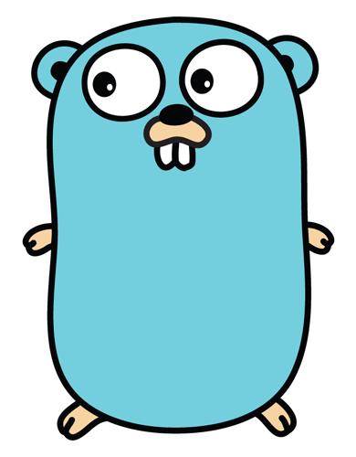
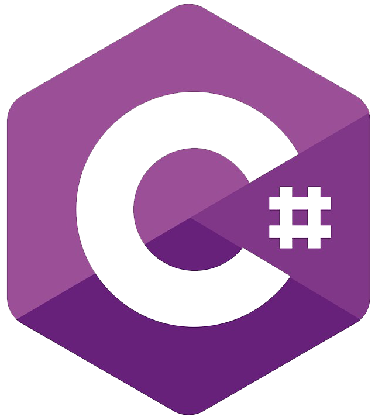

<h1>Hi there 👋, I'm Mikolaj.</h1>
<h5>Senior Developer and DevOps Engineer with a passion for continuous learning and innovation. Proficient in AI and ML with PyTorch and TensorFlow, experienced in backend development using Golang, and skilled in managing Kubernetes clusters with ArgoCD and Helm. Extensive experience with AWS and Terraform for infrastructure automation. Committed to delivering robust and scalable solutions while driving efficiency and automation in development pipelines. Explore my repositories for a deeper insight into my work and expertise.</h5>
<h3>Certifications, I achieved:</h3>

  
  
  
  
  
  

<h3>Technologies, I worked with:</h3>

  
  
  
  
  
  
  <!-- 
  
  
  
  
  
  
   -->

<h3>Experience:</h3>
<h5>You can download my CV below 👇.</h5>
<ul>
  <li>
    <a href="https://github.com/mikolajsemeniuk/mikolajsemeniuk/blob/main/cvs/cv_mikolaj_semeniuk_en.pdf">
      english (PDF)
    </a>
  </li>
  <li>
    <a href="https://github.com/mikolajsemeniuk/mikolajsemeniuk/blob/main/cvs/cv_mikolaj_semeniuk_pl.pdf">
      polish (PDF)
    </a>
  </li>
 </ul>
 <h3>Activity:</h3>
 <ul>
  <li>
    <a href="https://stackoverflow.com/users/13947931/mikolaj-semeniuk">
      StackOverflow
    </a>
  </li>
  <li>
    <a href="https://math.stackexchange.com/users/872720/mikolaj-semeniuk">
      Math StackExchange
    </a>
  </li>
 </ul>
